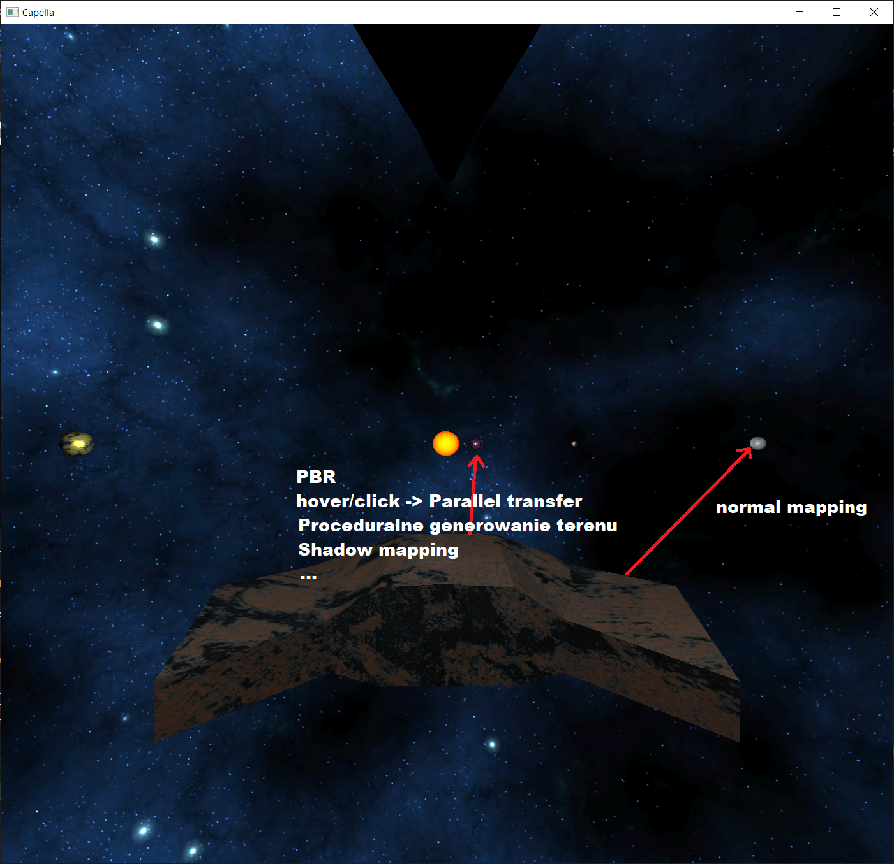
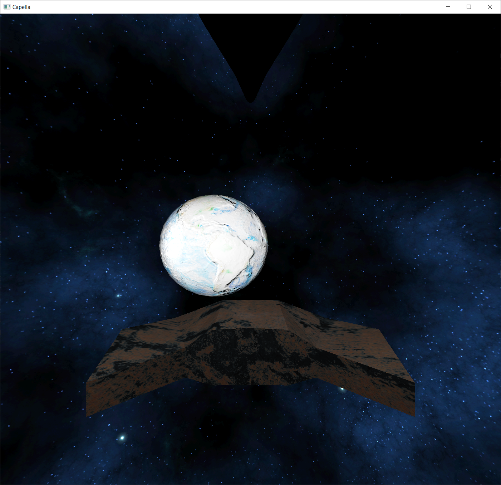
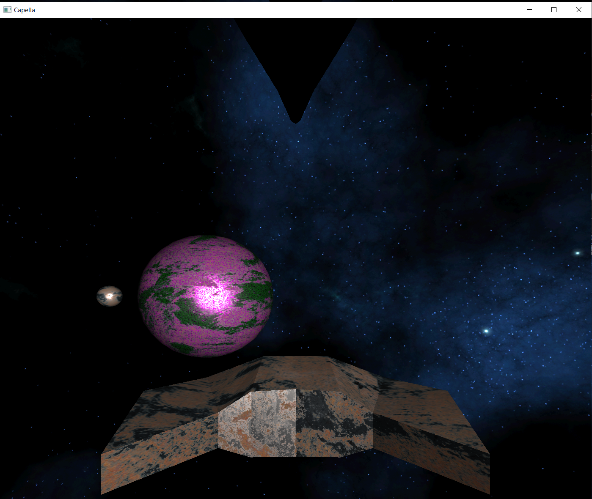
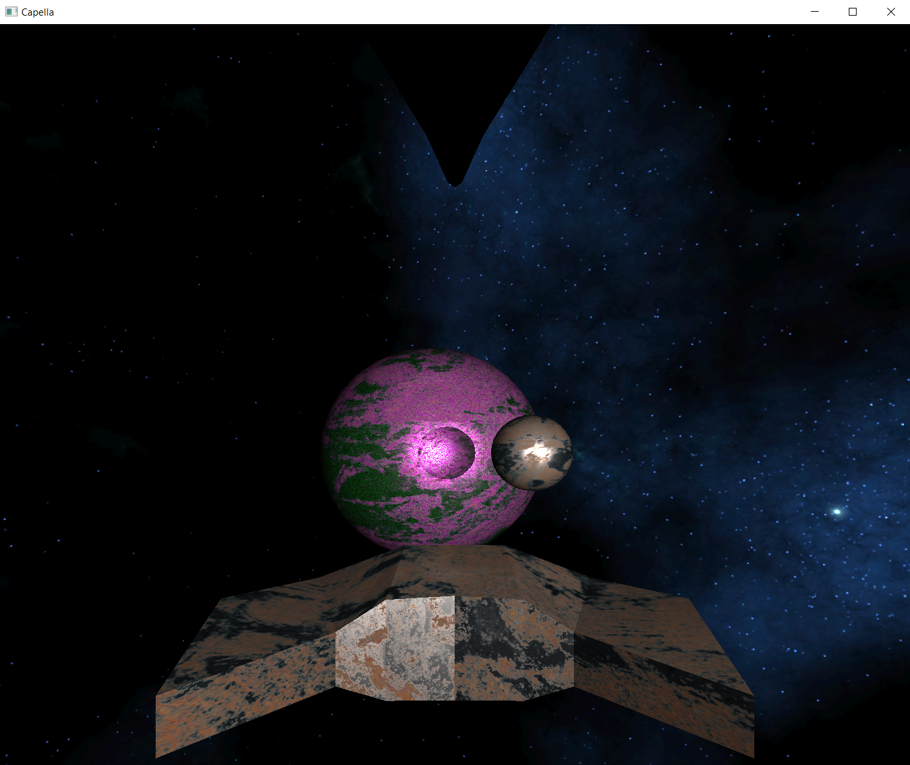
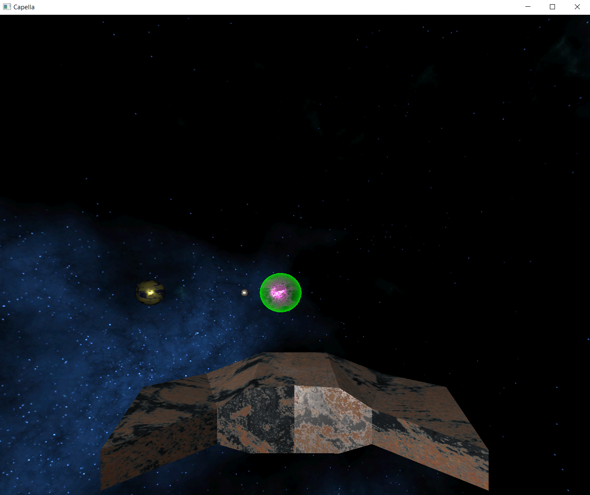
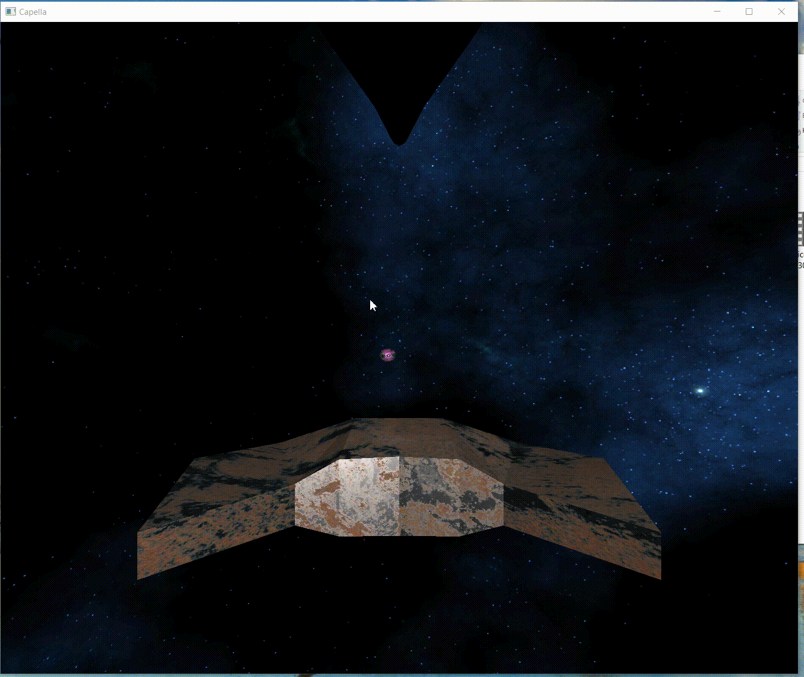
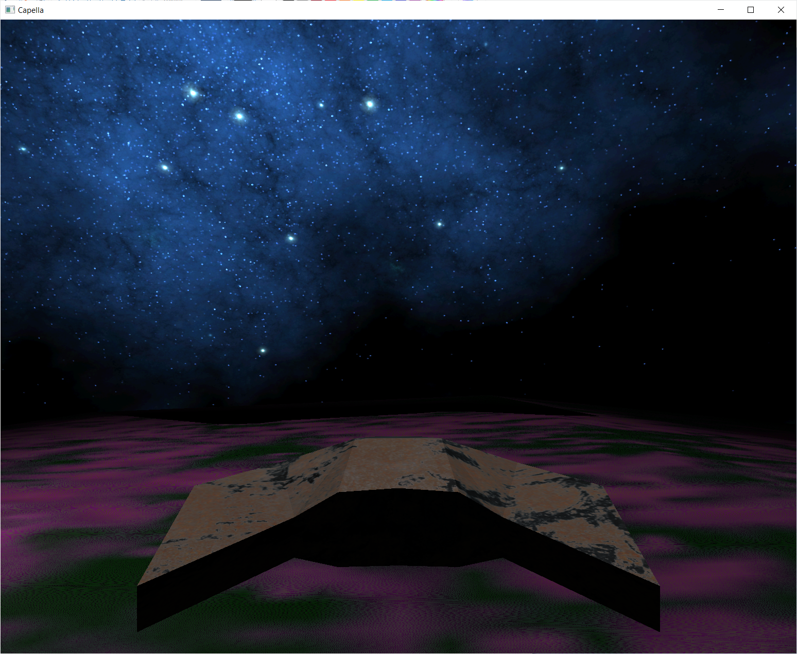

# Capella
--- 
###   Skład zespołu projektowego:
- Yahor Haleznik
- Tim Barvenov
- Pavel Bialko
---    
###   Opis projektu:

Projekt Capella to interaktywna wizualizacja sceny kosmicznej, 
umożliwiająca użytkownikowi eksplorację kosmosu oraz przestrzeni wokół planet. 
Wizualizacja obejmuje różnorodne elementy, takie jak planety, statki kosmiczne 
i gwiazdy, a także efekty oświetlenia, cienie oraz proceduralnie generowany teren planet.

--- 
### Główne elementy projektu i używane metody to:
- Grafika 3D: Wykorzystując biblioteki OpenGL, projekt prezentuje trójwymiarowe modele planet, 
statków kosmicznych oraz gwiazd.

- Normal mapping: dla niektórych planet

- Oświetlenie PBR: Dzięki technice Physical-Based Rendering (PBR), 
wizualizacja zapewnia realistyczne oświetlenie obiektów, uwzględniające interakcje światła z powierzchnią obiektów.

- Shadow Mapping: Implementacja efektów cieniowania, dodająca głębi i realizmu renderowanym obiektom.

- Ray-casting: dla implementacji hover/click na dostępnych planetach (pszy najechanie
  myszką planeta będzie świecić na zielono)

- Parallel transfer: po kliknienciu na dostępną planetę zaczyna się animacja statku lecącego w stronę tej planety
  po wcześniej wygenerowanej krzywej, odpowiednio wydłużonej i nachylonej.

- Proceduralne generowanie terenu: Wykorzystując algorytmy proceduralne, projekt generuje różnorodne tereny planet, 
co zapewnia unikalne doświadczenia przy każdym uruchomieniu.

- Skybox
- Interaktywność: Użytkownik może interaktywnie poruszać się po scenie kosmicznej za pomocą klawiatury, 
używać muszki do wyboru planety, latać wzdłuż powierzchni planety, zmieniając perspektywę 
i obserwując sceny z różnych punktów widzenia.
- Animacje: Projekt obejmuje animacje ruchu statku kosmicznego, wejście na orbitę planety oraz
obrót planety, co dodaje realizmu i dynamiki do wizualizacji.
---        
Projekt Capella jest demonstracją użycia różnych metod grafiki komputerowej w kontekście symulacji kosmicznych, 
jednocześnie oferując interaktywną i atrakcyjną wizualizację dla użytkownika.
